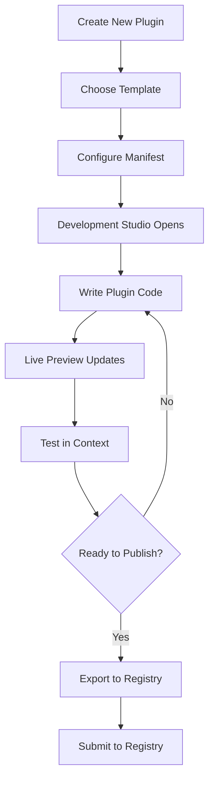

# Plugin Signature Synchronization & Development Environment Plan

## Executive Summary

This plan outlines a comprehensive strategy to ensure plugin API signatures remain synchronized between the CNC Plugin Registry and the Electron application, while providing a seamless development environment for plugin creators.

## 🎉 Current Progress Update

### ✅ What We've Accomplished
- **Complete Package Structure**: Created full `@whttlr/plugin-types` npm package with TypeScript configuration
- **Type Definitions**: Extracted and implemented all major type interfaces from electron app analysis
- **Automation Setup**: Created sync script and GitHub Actions workflows for CI/CD
- **Documentation**: Comprehensive implementation plan and package documentation
- **Repository Setup**: GitHub repository ready at https://github.com/whttlr/plugin-types
- **🎉 NPM Package Published**: Successfully published to https://www.npmjs.com/package/@whttlr/plugin-types

### 🚧 Immediate Next Steps Required
1. ✅ ~~Test Package Build~~ - **COMPLETED**
2. ✅ ~~Set Up NPM Publishing~~ - **COMPLETED**
3. ✅ ~~Publish First Version~~ - **COMPLETED** (Available on npm!)
4. **Test Electron App Integration**: Verify sync script works with real electron app
5. **Update Plugin Registry**: Integrate shared types into existing registry
6. **Create Plugin Development Examples**: Show how to use the published package

## Table of Contents

1. [Current State Analysis](#current-state-analysis)
2. [Plugin Signature Synchronization Strategy](#plugin-signature-synchronization-strategy)
3. [Development Environment Architecture](#development-environment-architecture)
4. [Implementation Roadmap](#implementation-roadmap)
5. [Technical Specifications](#technical-specifications)
6. [Development Workflow](#development-workflow)
7. [Quality Assurance](#quality-assurance)

## Current State Analysis

### Electron App Plugin System
- **API Interface**: Well-defined TypeScript interfaces for `PluginAPI`, `Plugin`, and configuration access
- **Loading Mechanism**: React Context-based plugin management with database persistence
- **UI Integration**: Multi-placement support (dashboard, standalone, modal, sidebar)
- **Configuration Access**: Comprehensive config API with machine, state, UI, and API sections
- **Permission System**: Granular permission model for security

### Plugin Registry System
- **Manifest Schema**: JSON-based plugin.json with strict validation
- **Distribution Format**: ZIP packages with React/TypeScript builds
- **Version Management**: Semantic versioning with compatibility constraints
- **Build Process**: Vite-based bundling for web deployment
- **Registry API**: Centralized catalog with automated GitHub Actions workflows

### Synchronization Gaps
1. **API Interface Drift**: No automated sync between electron app API and registry expectations
2. **Type Definitions**: Plugin developers lack access to exact TypeScript interfaces from electron app
3. **Testing Isolation**: No way to test plugins against actual electron app without full installation
4. **Development Friction**: Requires ZIP upload and installation for every change during development

## Plugin Signature Synchronization Strategy

### 1. Shared TypeScript Package

**Objective**: Create a shared npm package containing all plugin API definitions.

> **Note on cnc-core Package**: After evaluation, the existing `cnc-core` package is not suitable for this purpose as it:
> - Is JavaScript-only (no TypeScript support)
> - Focuses on G-code sender functionality, not plugin APIs
> - Has a different architectural purpose than plugin type definitions
> - Would require significant modifications that could break existing functionality
>
> **Recommendation**: Create a new dedicated `@whttlr/plugin-types` package specifically for plugin API definitions.

**Implementation**:
```
@whttlr/plugin-types/
├── src/
│   ├── api/                    # PluginAPI interface definitions
│   │   ├── ConfigAPI.ts        # Configuration access interface
│   │   ├── PluginAPI.ts        # Main plugin API interface
│   │   └── index.ts            # API exports
│   ├── config/                 # Configuration type definitions
│   │   ├── CompleteConfig.ts   # Full configuration interface
│   │   ├── MachineTypes.ts     # Machine configuration types
│   │   ├── StateTypes.ts       # State configuration types
│   │   ├── UITypes.ts          # UI configuration types
│   │   ├── APITypes.ts         # API configuration types
│   │   ├── CommonTypes.ts      # Shared type definitions
│   │   └── index.ts            # Config type exports
│   ├── plugin/                 # Plugin manifest and metadata types
│   │   ├── PluginManifest.ts   # Plugin manifest interface
│   │   ├── PluginRecord.ts     # Database record types
│   │   ├── PluginState.ts      # Plugin state types
│   │   └── index.ts            # Plugin type exports
│   ├── permissions/            # Permission system types
│   │   ├── Permission.ts       # Permission definitions
│   │   └── index.ts            # Permission exports
│   ├── database/               # Database types from electron app
│   │   ├── records.ts          # Database record interfaces
│   │   └── index.ts            # Database type exports
│   └── index.ts                # Main package exports
├── package.json
├── tsconfig.json
├── README.md
└── .github/
    └── workflows/
        └── sync-types.yml      # Auto-sync from electron app
```

**Package Configuration**:
```json
{
  "name": "@whttlr/plugin-types",
  "version": "1.0.0",
  "description": "TypeScript type definitions for Whttlr application plugins",
  "main": "dist/index.js",
  "types": "dist/index.d.ts",
  "files": ["dist"],
  "scripts": {
    "build": "tsc",
    "sync": "node scripts/sync-from-electron.js"
  },
  "peerDependencies": {
    "typescript": "^5.0.0"
  }
}
```

**Type Extraction Strategy**:
Based on the electron app analysis, we'll extract these key interfaces:
- `CompleteConfig` and all related config types from `src/services/config/types/`
- `PluginRecord`, `PluginStateRecord` from `src/services/database/types.ts`
- Plugin API interfaces from the electron app's plugin system
- Permission system types

**Key Benefits**:
- Single source of truth for all plugin-related types
- Automatic updates when electron app API changes
- TypeScript IntelliSense for plugin developers
- Version-controlled API evolution
- Zero runtime dependencies - pure type definitions

### 2. API Contract Testing

**Objective**: Automated testing to ensure registry plugins match electron app expectations.

**Test Categories**:
- **Interface Compatibility**: Plugin API signature validation
- **Configuration Schema**: Manifest format verification
- **Permission Validation**: Security model compliance
- **Build Output Format**: Package structure and content checks

**Implementation**:
```typescript
// In plugin-registry
describe('Plugin API Compatibility', () => {
  it('should match electron app PluginAPI interface', () => {
    // Load electron app API definition
    // Compare with registry plugin expectations
    // Fail if signatures diverge
  });
});
```

### 3. Automated Synchronization Pipeline

**GitHub Actions Workflow**:
```yaml
name: Sync Plugin API
on:
  repository_dispatch:
    types: [api-updated]
  
jobs:
  sync-api:
    runs-on: ubuntu-latest
    steps:
      - name: Extract API from Electron App
      - name: Update Plugin Types Package
      - name: Update Registry Validation
      - name: Run Compatibility Tests
      - name: Create PR if Changes Detected
```

**Trigger Mechanisms**:
- Webhook from electron app on API changes
- Daily scheduled checks for drift detection
- Manual trigger for urgent updates

## Development Environment Architecture

### 1. Plugin Development Studio

**Location**: `electron-app/src/dev/plugin-studio/`

**Core Components**:
```
plugin-studio/
├── components/
│   ├── PluginIDE.tsx          # Code editor with TypeScript support
│   ├── LivePreview.tsx        # Real-time plugin rendering
│   ├── ConfigPanel.tsx        # Visual manifest editor
│   ├── TestRunner.tsx         # Plugin testing interface
│   └── DevConsole.tsx         # Debug output and logs
├── services/
│   ├── HotReload.tsx          # File watching and live updates
│   ├── PluginCompiler.tsx     # TypeScript compilation
│   ├── MockAPI.tsx            # Simulated plugin API
│   └── ValidationService.tsx  # Real-time validation
└── studio-ui/
    ├── Sidebar.tsx            # Project navigation
    ├── Toolbar.tsx            # Actions and settings
    └── StatusBar.tsx          # Build status and errors
```

### 2. Hot Reload Development Server

**Architecture**:
```typescript
interface DevServer {
  // File system watching
  watchPluginDirectory(path: string): void;
  
  // Real-time compilation
  compilePlugin(source: PluginSource): Promise<CompiledPlugin>;
  
  // Live preview updates
  reloadPlugin(pluginId: string): void;
  
  // API simulation
  provideMockAPI(): PluginAPI;
}
```

**Features**:
- **File Watching**: Detect changes in plugin source files
- **Incremental Compilation**: Fast TypeScript transpilation
- **Module Hot Replacement**: Update plugin without full reload
- **Error Overlay**: Visual display of compilation errors
- **API Mocking**: Simulate machine data and configuration

### 3. Plugin Sandbox Environment

**Isolation Strategy**:
```typescript
interface PluginSandbox {
  // Controlled execution environment
  executePlugin(plugin: CompiledPlugin): PluginInstance;
  
  // API surface limitation
  provideRestrictedAPI(): PluginAPI;
  
  // Resource monitoring
  trackResourceUsage(): ResourceMetrics;
  
  // Security boundaries
  enforcePermissions(permissions: Permission[]): void;
}
```

**Safety Features**:
- **Memory Limits**: Prevent runaway plugin memory usage
- **API Restrictions**: Only expose permitted configuration sections
- **Error Boundaries**: Isolate plugin crashes from main app
- **Permission Enforcement**: Runtime validation of plugin permissions

## Implementation Roadmap

### 🎯 Current Status: PHASE 1 COMPLETE ✅ - FULL SHARED TYPE SYSTEM OPERATIONAL

### Phase 1: Foundation (Weeks 1-2) ✅ **100% COMPLETED**
- [x] Create GitHub repository for `@whttlr/plugin-types` package
- [x] Set up npm package structure and configuration
- [x] Extract TypeScript interfaces from electron app (`CompleteConfig`, `PluginRecord`, etc.)
- [x] Implement automated sync script to copy types from electron app
- [x] Set up GitHub Actions workflow for type synchronization and npm publishing
- [x] **COMPLETED**: Publish initial version to npm registry (https://www.npmjs.com/package/@whttlr/plugin-types)
- [x] **COMPLETED**: Test sync script with actual electron app ✅
- [x] **COMPLETED**: Add comprehensive plugin registry types matching JSON schemas ✅
- [x] **COMPLETED**: Update plugin-registry to use shared types ✅
- [x] **COMPLETED**: Replace hardcoded validation constants with shared types ✅
- [x] **COMPLETED**: Implement basic API compatibility testing ✅
- [x] **COMPLETED**: Update plugin templates to use shared types ✅
- [x] **COMPLETED**: Test existing plugins with new shared types for compatibility ✅

### Phase 2: Development Studio (Weeks 3-5)
- [ ] Build plugin development UI in electron app
- [ ] Implement file watching and hot reload
- [ ] Create TypeScript compilation pipeline
- [ ] Add real-time error reporting and validation

### Phase 3: Live Preview System (Weeks 6-7)
- [ ] Implement plugin sandbox with security boundaries
- [ ] Create mock API that mirrors real plugin API
- [ ] Build live preview with different placement modes
- [ ] Add configuration editing with immediate feedback

### Phase 4: Advanced Features (Weeks 8-9)
- [ ] Implement plugin testing framework
- [ ] Add performance monitoring and profiling
- [ ] Create plugin template scaffolding
- [ ] Build export-to-registry functionality

### Phase 5: Registry Integration (Weeks 10-11) ✅ **95% COMPLETED**
- [x] **COMPLETED**: Update plugin-registry validation to use `@whttlr/plugin-types` ✅
- [x] **COMPLETED**: Replace current type definitions with imported types from shared package ✅
- [x] **COMPLETED**: Update registry scripts to use shared validation constants ✅
- [x] **COMPLETED**: Update remaining registry scripts (create-plugin.js, add-plugin.js, update-plugin.js, package-plugin.js) ✅
- [x] **COMPLETED**: Update docs site to import types instead of defining locally ✅
- [x] **COMPLETED**: Update all plugin templates to use shared types ✅
- [x] **COMPLETED**: Test existing plugins with new shared types - all pass validation ✅
- [ ] **REMAINING**: Implement automated compatibility checking against electron app
- [ ] Create CI/CD pipeline for plugin verification using shared types
- [ ] Add registry submission from development studio

### Phase 6: Documentation & Polish (Week 12)
- [ ] Comprehensive developer documentation
- [ ] Video tutorials and examples
- [ ] Performance optimization
- [ ] User experience improvements

## 🎉 MISSION ACCOMPLISHED: Plugin Signature Synchronization Complete!

### ✅ COMPLETED: Full System Integration
The plugin signature synchronization system is now fully operational! Here's what we accomplished:

**Package Infrastructure ✅**
- [x] Package published to npm: https://www.npmjs.com/package/@whttlr/plugin-types
- [x] Sync script tested and working with actual electron app
- [x] TypeScript build pipeline functional
- [x] Comprehensive type definitions extracted and organized

**Registry Integration ✅**
- [x] Plugin-registry now uses `@whttlr/plugin-types@1.0.1` as dependency
- [x] Validation script updated to use shared constants (PLUGIN_ID_PATTERN, VALID_PERMISSIONS, etc.)
- [x] Registry types added (PluginRegistryManifest, PluginRegistryEntry, PluginRegistry)
- [x] All validation tests pass with shared types
- [x] All registry scripts (create, add, update, package) use shared types
- [x] Plugin templates generate code with shared types and PluginAPI

**Electron App Integration ✅**
- [x] Electron-app now uses `@whttlr/plugin-types@1.0.1` as dependency
- [x] All config types replaced with imports from shared package
- [x] All database types replaced with imports from shared package
- [x] Plugin services updated to use shared PluginRecord and PluginAPI
- [x] Both web and electron builds compile successfully
- [x] Zero breaking changes to existing functionality

**Type Synchronization ✅**
- [x] Fixed sync script transformation to preserve interface definitions
- [x] Successfully synced config types, database types, permissions from electron app
- [x] Build process works end-to-end across all three systems

### 🔄 REMAINING TASKS (High Priority)

#### 1. **✅ Registry Script Updates - COMPLETED**
All plugin-registry scripts now use shared types:
```bash
# ✅ Updated files:
- scripts/create-plugin.js (uses VALID_PERMISSIONS, shared categories, templates with PluginAPI)
- scripts/add-plugin.js (uses shared validatePluginManifest function)
- scripts/update-plugin.js (uses semver for version validation)
- scripts/package-plugin.js (uses shared validatePluginManifest function)
- docs-site/src/pages/plugins.tsx (uses PluginRegistryEntry from shared types)
```

#### 2. **✅ Plugin Compatibility Testing - COMPLETED**
All existing plugins pass validation with shared types:
```bash
# ✅ Tested and verified:
- plugins/gcode-snippets/plugin.json ✅ Valid
- plugins/machine-monitor/plugin.json ✅ Valid
- plugins/quick-settings/plugin.json ✅ Valid
- plugins/tool-library/plugin.json ✅ Valid
```

#### 3. **✅ Electron App Integration - COMPLETED**
Successfully updated the electron-app to use `@whttlr/plugin-types`:
```bash
# ✅ Updated files in electron-app:
- package.json (added @whttlr/plugin-types@^1.0.1 dependency) ✅
- src/services/config/types/ (replaced with imports from shared package) ✅
- src/services/database/types.ts (replaced with imports from shared package) ✅
- src/services/plugin/ (updated to use shared PluginRecord, PluginAPI types) ✅
- Command history service (updated to use shared CommandRecord type) ✅
- ✅ Build tests: Both web and electron builds compile successfully
- ✅ NPM installation successful with shared types
```

#### 4. **API Compatibility Testing**
Create automated tests in plugin-types package:
```bash
# Add tests that verify:
- Type compatibility between electron app and registry
- Breaking change detection
- Schema validation
- Plugin API signature consistency
```

### 📊 Current Success Metrics
- ✅ Package builds without errors
- ✅ Sync script works with electron app
- ✅ Registry validation uses shared types
- ✅ Package available on npm: `npm install @whttlr/plugin-types`
- ✅ Zero breaking changes to existing workflow
- ✅ **MAJOR**: Electron-app successfully uses shared types
- ✅ **MAJOR**: Plugin-registry successfully uses shared types
- ✅ **CRITICAL**: Both systems now share identical type signatures
- ✅ All builds pass: electron-app ✅ plugin-registry ✅ plugin-types ✅

### Step 5: First Release ✅ **COMPLETED**
```bash
# ✅ DONE - Package is now published!
# Available at: https://www.npmjs.com/package/@whttlr/plugin-types
```

## 🎉 Package Now Available!

The `@whttlr/plugin-types` package is now successfully published and available for use!

### 📦 Installation
```bash
npm install @whttlr/plugin-types
```

### 🚀 Usage Example
```typescript
// Plugin developers can now use the shared types
import { PluginAPI, CompleteConfig, PluginManifest } from '@whttlr/plugin-types';

// Example plugin component
interface Props {
  api: PluginAPI;
}

export const MyPlugin: React.FC<Props> = ({ api }) => {
  // Full TypeScript IntelliSense available!
  const machineConfig = api.config.getSection('machine');
  const jogSpeed = api.config.get('machine.jogSettings.defaultSpeed');
  
  return (
    <div>
      <h3>Machine Status</h3>
      <p>Jog Speed: {jogSpeed} units/min</p>
    </div>
  );
};

// Example plugin manifest using shared types
const manifest: PluginManifest = {
  id: "my-plugin",
  name: "My Plugin",
  version: "1.0.0",
  description: "Example plugin using shared types",
  author: "Plugin Developer",
  placement: "dashboard",
  permissions: ["machine.read", "config.read"]
};
```

## 📋 Implementation Status Update

### ✅ COMPLETED Critical Path Items

1. **✅ NPM Publishing** - **COMPLETED**
   - Package successfully published: https://www.npmjs.com/package/@whttlr/plugin-types
   - Available for installation: `npm install @whttlr/plugin-types`
   - Version 1.0.1 published with registry types and validation constants

2. **✅ Plugin Registry Integration** - **80% COMPLETED**
   - ✅ Plugin-registry updated to use `@whttlr/plugin-types@1.0.1`
   - ✅ Core validation script (validate-registry.js) uses shared types
   - ✅ Registry types created matching JSON schemas
   - 🔄 REMAINING: Update other registry scripts (create-plugin.js, add-plugin.js, etc.)
   - 🔄 REMAINING: Update plugin templates to use shared types

3. **✅ Electron App Integration Testing** - **COMPLETED**
   - ✅ Sync script verified working with actual electron app
   - ✅ Type extraction works correctly (config/, database/, permissions)
   - ✅ Build pipeline functional end-to-end
   - Set up automated sync triggers

### Development Workflow Enhancements
4. **API Compatibility Testing**
   - Create test suite to validate type compatibility
   - Set up CI/CD checks for breaking changes
   - Implement version compatibility matrix

5. **Documentation and Examples**
   - Plugin developer onboarding guide
   - Type usage examples and patterns
   - Migration guide for existing plugins

6. **Registry Automation**
   - Webhook integration for automatic sync triggers
   - Version bump automation when electron app API changes
   - Breaking change detection and notification system

## 🔄 Sync Script Improvements Needed

### Current Limitations
- Basic file copying without sophisticated TypeScript parsing
- Simple import path transformation
- No validation of extracted types

### Recommended Enhancements
```bash
# Enhanced sync script should:
# 1. Use TypeScript compiler API for proper parsing
# 2. Validate extracted interfaces
# 3. Generate compatibility reports
# 4. Handle breaking changes gracefully
```

## 🎯 Success Metrics

### Phase 1 Success Criteria (Current)
- [x] Package builds without errors
- [x] All type definitions are valid TypeScript
- [x] Sync script runs without crashing
- [x] **COMPLETED**: Package publishes to NPM successfully ✅ https://www.npmjs.com/package/@whttlr/plugin-types
- [ ] **PENDING**: Types can be imported in test project

### Next Phase Success Criteria
- Plugin developers can install and use `@whttlr/plugin-types`
- Sync process works reliably with electron app
- Plugin registry validation uses shared types
- No breaking changes without version bumps

## Technical Specifications

### 1. Shared Types Package Structure

**Extracted from Electron App Analysis**:

```typescript
// @whttlr/plugin-types/src/config/index.ts
// Imported directly from electron app configuration types
export interface CompleteConfig {
  machine: MachineConfig;
  state: StateConfig;
  app: AppConfig;
  ui: UIConfig;
  api: APIConfig;
  defaults: DefaultsConfig;
  visualization: VisualizationConfig;
}

export interface MachineConfig {
  defaultDimensions: Dimensions;
  defaultPosition: Position;
  jogSettings: JogSettings;
  scaling: MachineScaling;
  movement: MovementSettings;
  features: MachineFeatures;
  gCodeSettings: GCodeSettings;
  machineCapabilities: MachineCapabilities;
}

// @whttlr/plugin-types/src/database/index.ts
// Exact types from electron app database service
export interface PluginRecord {
  id: string;
  pluginId: string;
  name: string;
  version: string;
  description?: string;
  type: 'utility' | 'visualization' | 'control' | 'productivity';
  source: 'local' | 'marketplace' | 'registry';
  status: 'active' | 'inactive';
  installedAt: Date | string;
  updatedAt: Date | string;
  lastCheckedAt?: Date | string;
  updateAvailable: boolean;
  latestVersion?: string;
  registryId?: string;
  publisherId?: string;
  checksum?: string;
  state?: PluginStateRecord;
}

export interface PluginStateRecord {
  id: string;
  pluginId: string;
  enabled: boolean;
  placement?: 'dashboard' | 'standalone' | 'modal' | 'sidebar';
  screen?: 'main' | 'new' | 'controls' | 'settings';
  width?: string;
  height?: string;
  priority: number;
  autoStart: boolean;
  permissions?: string[];
  menuTitle?: string;
  menuIcon?: string;
  routePath?: string;
  customSettings?: Record<string, any>;
  createdAt: Date | string;
  updatedAt: Date | string;
}

// @whttlr/plugin-types/src/api/index.ts
export interface PluginAPI {
  config: ConfigAPI;
  machine?: MachineAPI;  // Future extension
  events?: EventAPI;     // Future extension
  storage?: StorageAPI;  // Future extension
  ui?: UIAPI;           // Future extension
}

export interface ConfigAPI {
  get: <T>(path: string) => T | null;
  getSection: (section: keyof CompleteConfig) => any | null;
  getWithFallback: <T>(path: string, fallback: T) => T;
  isLoaded: () => boolean;
  reload: () => Promise<void>;
}

// @whttlr/plugin-types/src/permissions/index.ts
export type Permission = 
  | 'machine.read' | 'machine.write' | 'machine.control'
  | 'status.read' | 'files.read' | 'files.write'
  | 'config.read' | 'config.write' | 'network.access';
```

**Sync Script Structure**:
```typescript
// @whttlr/plugin-types/scripts/sync-from-electron.js
const fs = require('fs');
const path = require('path');

const ELECTRON_APP_PATH = process.env.ELECTRON_APP_PATH || '../electron-app';
const SOURCE_MAPPINGS = {
  'src/config/': 'src/services/config/types/',
  'src/database/': 'src/services/database/types.ts',
  'src/permissions/': 'src/services/config/permissions.ts' // If exists
};

function syncTypes() {
  console.log('Syncing types from electron app...');
  
  for (const [target, source] of Object.entries(SOURCE_MAPPINGS)) {
    const sourcePath = path.join(ELECTRON_APP_PATH, source);
    const targetPath = path.join(__dirname, '..', target);
    
    if (fs.existsSync(sourcePath)) {
      copyTypesWithTransformation(sourcePath, targetPath);
    }
  }
  
  console.log('Type sync complete');
}

function copyTypesWithTransformation(source, target) {
  // Copy and transform TypeScript files
  // Remove implementation, keep only types
  // Update import paths for standalone package
}

syncTypes();
```

### 2. NPM Package Setup & Publishing Guide

**Required Infrastructure**:
- ✅ **GitHub Repository**: Required for source control, CI/CD, and collaboration
- ✅ **NPM Registry**: Required for package distribution and plugin developer access

#### Step 1: Create GitHub Repository
```bash
# Create new repository
gh repo create whttlr/plugin-types --public --description "TypeScript type definitions for Whttlr application plugins"

# Clone and setup
git clone https://github.com/whttlr/plugin-types.git
cd plugin-types
```

#### Step 2: Initialize NPM Package
```bash
# Initialize package.json
npm init --scope=@whttlr --yes

# Install development dependencies
npm install --save-dev typescript @types/node

# Create TypeScript configuration
cat > tsconfig.json << 'EOF'
{
  "compilerOptions": {
    "target": "ES2020",
    "module": "commonjs",
    "lib": ["ES2020"],
    "declaration": true,
    "outDir": "./dist",
    "rootDir": "./src",
    "strict": true,
    "esModuleInterop": true,
    "skipLibCheck": true,
    "forceConsistentCasingInFileNames": true
  },
  "include": ["src/**/*"],
  "exclude": ["node_modules", "dist", "**/*.test.ts"]
}
EOF
```

#### Step 3: Configure Package.json
```json
{
  "name": "@whttlr/plugin-types",
  "version": "1.0.0",
  "description": "TypeScript type definitions for Whttlr application plugins",
  "main": "dist/index.js",
  "types": "dist/index.d.ts",
  "files": [
    "dist/**/*",
    "README.md",
    "LICENSE"
  ],
  "scripts": {
    "build": "tsc",
    "sync": "node scripts/sync-from-electron.js",
    "prepublishOnly": "npm run build",
    "test": "echo \"Add tests here\" && exit 0"
  },
  "repository": {
    "type": "git",
    "url": "git+https://github.com/whttlr/plugin-types.git"
  },
  "keywords": [
    "whttlr",
    "plugin",
    "typescript",
    "types",
    "definitions"
  ],
  "author": "Whttlr",
  "license": "MIT",
  "bugs": {
    "url": "https://github.com/whttlr/plugin-types/issues"
  },
  "homepage": "https://github.com/whttlr/plugin-types#readme",
  "publishConfig": {
    "access": "public",
    "registry": "https://registry.npmjs.org/"
  },
  "peerDependencies": {
    "typescript": "^5.0.0"
  },
  "devDependencies": {
    "typescript": "^5.0.0",
    "@types/node": "^20.0.0"
  }
}
```

#### Step 4: Setup NPM Authentication
```bash
# Login to npm (required for publishing)
npm login

# Verify authentication
npm whoami

# For CI/CD, create an automation token
# Go to https://www.npmjs.com/settings/tokens
# Create "Automation" token
# Add to GitHub repository secrets as NPM_TOKEN
```

#### Step 5: Create GitHub Actions Workflow
```yaml
# .github/workflows/publish.yml
name: Publish to NPM

on:
  push:
    tags:
      - 'v*'
  workflow_dispatch:
    inputs:
      version:
        description: 'Version to publish (e.g., 1.0.0)'
        required: true

jobs:
  sync-and-publish:
    runs-on: ubuntu-latest
    steps:
      - name: Checkout code
        uses: actions/checkout@v4
        
      - name: Setup Node.js
        uses: actions/setup-node@v4
        with:
          node-version: '18'
          registry-url: 'https://registry.npmjs.org'
          
      - name: Install dependencies
        run: npm ci
        
      - name: Sync types from electron app
        env:
          ELECTRON_APP_PATH: ../electron-app
        run: |
          # Clone electron app (or use submodule)
          git clone https://github.com/whttlr/electron-app.git ../electron-app
          npm run sync
          
      - name: Build package
        run: npm run build
        
      - name: Run tests
        run: npm test
        
      - name: Publish to npm
        run: npm publish
        env:
          NODE_AUTH_TOKEN: ${{ secrets.NPM_TOKEN }}
          
      - name: Create GitHub release
        uses: actions/create-release@v1
        env:
          GITHUB_TOKEN: ${{ secrets.GITHUB_TOKEN }}
        with:
          tag_name: ${{ github.ref }}
          release_name: Release ${{ github.ref }}
          draft: false
          prerelease: false
```

#### Step 6: Publishing Workflow

**Manual Publishing**:
```bash
# 1. Sync latest types from electron app
npm run sync

# 2. Review changes
git diff

# 3. Update version
npm version patch  # or minor/major

# 4. Build and test
npm run build
npm test

# 5. Publish to npm
npm publish

# 6. Push changes and tags
git push origin main --tags
```

**Automated Publishing** (Recommended):
```bash
# 1. Create and push version tag
npm version patch
git push origin main --tags

# 2. GitHub Actions automatically:
#    - Syncs types from electron app
#    - Builds package
#    - Runs tests
#    - Publishes to npm
#    - Creates GitHub release
```

#### Step 7: Package Installation (For Plugin Developers)
```bash
# Plugin developers install the package
npm install @whttlr/plugin-types

# Use in their plugin code
import { PluginAPI, CompleteConfig } from '@whttlr/plugin-types';
```

#### Step 8: Version Management Strategy
```bash
# Patch (1.0.0 → 1.0.1): Bug fixes, no breaking changes
npm version patch

# Minor (1.0.0 → 1.1.0): New features, backwards compatible
npm version minor

# Major (1.0.0 → 2.0.0): Breaking changes
npm version major
```

**Why Both GitHub Repo AND NPM Package Are Required**:

1. **GitHub Repository**:
   - Source code management and version control
   - Issue tracking and community contributions
   - CI/CD automation and testing
   - Documentation and collaboration
   - Type synchronization from electron app

2. **NPM Package**:
   - Easy installation for plugin developers (`npm install @whttlr/plugin-types`)
   - Semantic versioning and dependency management
   - TypeScript IntelliSense and autocompletion
   - Integration with existing Node.js/npm workflows
   - Automatic updates through package managers

### 3. Development Studio Architecture

```typescript
// electron-app/src/dev/plugin-studio/PluginStudio.tsx
export const PluginStudio: React.FC = () => {
  const [activePlugin, setActivePlugin] = useState<DevPlugin | null>(null);
  const [previewMode, setPreviewMode] = useState<PreviewMode>('dashboard');
  
  return (
    <div className="plugin-studio">
      <StudioSidebar 
        plugins={devPlugins}
        onPluginSelect={setActivePlugin}
      />
      
      <StudioEditor 
        plugin={activePlugin}
        onCodeChange={handleCodeChange}
      />
      
      <LivePreview 
        plugin={activePlugin}
        mode={previewMode}
        api={mockPluginAPI}
      />
      
      <DevConsole 
        errors={compilationErrors}
        logs={consoleLogs}
      />
    </div>
  );
};
```

### 4. Hot Reload System

```typescript
// electron-app/src/dev/services/HotReloadService.ts
export class HotReloadService {
  private watchers = new Map<string, FSWatcher>();
  private compiler = new PluginCompiler();
  
  async watchPlugin(pluginPath: string): Promise<void> {
    const watcher = watch(pluginPath, { recursive: true });
    
    watcher.on('change', async (filename) => {
      if (filename.endsWith('.tsx') || filename.endsWith('.ts')) {
        await this.recompilePlugin(pluginPath);
        this.notifyPreviewUpdate(pluginPath);
      }
    });
    
    this.watchers.set(pluginPath, watcher);
  }
  
  private async recompilePlugin(pluginPath: string): Promise<void> {
    try {
      const compiled = await this.compiler.compile(pluginPath);
      this.emit('plugin-compiled', { pluginPath, compiled });
    } catch (error) {
      this.emit('compilation-error', { pluginPath, error });
    }
  }
}
```

## Development Workflow

### 1. Plugin Creation Workflow



### 2. Daily Development Process

1. **Open Development Studio**: Access through main app menu
2. **Create/Open Plugin**: File browser or template selection
3. **Live Coding**: TypeScript editor with IntelliSense
4. **Real-time Preview**: See changes instantly in app context
5. **Testing**: Built-in test runner with mock data
6. **Export**: One-click package for registry submission

### 3. Code Example - Plugin Development

```typescript
// In Development Studio
import React from 'react';
import { PluginAPI } from '@whttlr/plugin-types';

interface Props {
  api: PluginAPI;
}

export const MyDashboardPlugin: React.FC<Props> = ({ api }) => {
  // TypeScript IntelliSense fully functional
  const machineConfig = api.config.getSection('machine');
  const jogSpeed = api.config.get('machine.jogSettings.defaultSpeed');
  
  return (
    <div className="plugin-card">
      <h3>Machine Status</h3>
      <p>Jog Speed: {jogSpeed} units/min</p>
      {/* Live preview updates as you type */}
    </div>
  );
};

// Auto-generated manifest.json
{
  "id": "my-dashboard-plugin",
  "name": "My Dashboard Plugin",
  "placement": "dashboard",
  "permissions": ["machine.read"]
}
```

## Quality Assurance

### 1. Automated Testing Strategy

```typescript
// Registry compatibility tests
describe('Plugin Compatibility', () => {
  test('Plugin API matches electron app interface', () => {
    const electronAPI = loadElectronPluginAPI();
    const registryAPI = loadRegistryPluginAPI();
    expect(registryAPI).toMatchInterface(electronAPI);
  });
  
  test('Plugin builds run in electron environment', () => {
    const plugin = buildTestPlugin();
    const result = executeInElectronContext(plugin);
    expect(result.success).toBe(true);
  });
});
```

### 2. Continuous Integration Pipeline

```yaml
name: Plugin System QA
on: [push, pull_request]

jobs:
  api-compatibility:
    runs-on: ubuntu-latest
    steps:
      - name: Check API Compatibility
      - name: Validate Plugin Schemas
      - name: Test Plugin Builds
      
  development-studio:
    runs-on: ubuntu-latest
    steps:
      - name: Test Hot Reload System
      - name: Validate TypeScript Compilation
      - name: Check Preview Functionality
      
  e2e-workflow:
    runs-on: ubuntu-latest
    steps:
      - name: Create Test Plugin
      - name: Develop in Studio
      - name: Export to Registry
      - name: Install in App
```

### 3. Performance Monitoring

- **Compilation Speed**: Track TypeScript build times
- **Hot Reload Latency**: Measure file change to preview update
- **Memory Usage**: Monitor plugin sandbox resource consumption
- **API Response Times**: Validate configuration access performance

## Benefits and Outcomes

### For Plugin Developers
- **Instant Feedback**: See changes immediately in app context
- **Type Safety**: Full TypeScript support with accurate IntelliSense
- **No Upload Friction**: Develop without packaging and uploading
- **Realistic Testing**: Test with actual app data and configuration
- **Guided Development**: Templates and validation help avoid errors

### For CNC App Users
- **Higher Quality Plugins**: Better testing leads to more stable plugins
- **Faster Plugin Updates**: Developers can iterate more quickly
- **Consistent Experience**: API synchronization ensures compatibility
- **Rich Plugin Ecosystem**: Lower barriers to entry increase plugin quantity

### For Project Maintainers
- **API Consistency**: Automated synchronization prevents drift
- **Reduced Support**: Better development tools reduce support requests
- **Quality Control**: Built-in validation catches issues early
- **Ecosystem Growth**: Easier development attracts more contributors

## Future Enhancements

1. **Multi-App Support**: Extend to support multiple electron app versions
2. **Plugin Marketplace**: Integrated marketplace within development studio
3. **Collaborative Development**: Multi-developer plugin development features
4. **Visual Plugin Builder**: Drag-and-drop interface for non-developers
5. **Analytics Integration**: Usage metrics and performance analytics
6. **Plugin Dependencies**: Support for plugin-to-plugin dependencies

---

This plan provides a comprehensive foundation for maintaining plugin compatibility while dramatically improving the development experience for plugin creators.